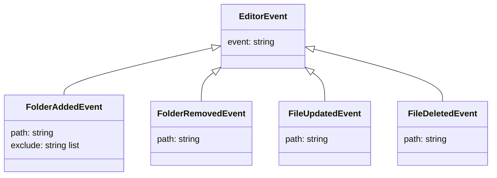

EditorEvents
===

`EditorEvents` defines data objects to support a queue of the editor events. The editor events are based on the VS Code workspace events.

```mermaid
classDiagram

EditorEvent <|-- FolderAddedEvent
EditorEvent <|-- FolderRemovedEvent
EditorEvent <|-- FileUpdatedEvent
EditorEvent <|-- FileDeletedEvent

class EditorEvent {
    event: string
}

class FolderAddedEvent {
    path: string
    exclude: string list
}

class FolderRemovedEvent {
    path: string
}

class FileUpdatedEvent {
    path: string
}

class FileDeletedEvent {
    path: string
}
```
