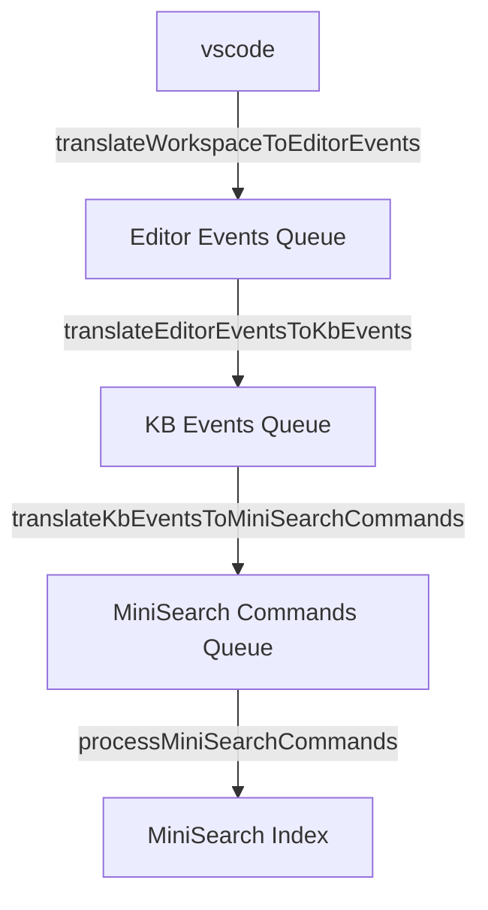

Extension
===

Diagram of the extension's data flow:

```mermaid
flowchart TB

A[vscode] -->|translateWorkspaceToEditorEvents| B[Editor Events Queue]
B -->|translateEditorEventsToKbEvents| C[KB Events Queue]
C -->|translateKbEventsToMiniSearchCommands| D[MiniSearch Commands Queue]
D -->|processMiniSearchCommands| E[MiniSearch Index]
```
