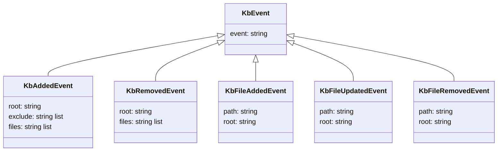

# KbEvents

KbEvents is a queue of the knowledge base events. Multiple producers can add events to the queue. Only one consumer reads events from the queue and processes them.

`KbAddedEvent.files` contains the knowledge base markdown files, except ones that match the excluded patterns. It is a list of files whose content should be parsed and added to the search index.

`KbRemovedEvent.files` contains the knowledge base markdown files that were indexed. It is a list of files whose content should be removed from the search index.

`KbFileAddedEvent`, `KbFileUpdatedEvent`, and `KbFileRemovedEvent` are only raised for the markdown files that are not excluded.

The events from the `KbEvents` queue are transformed into the `MiniSearchCommands` queue.

