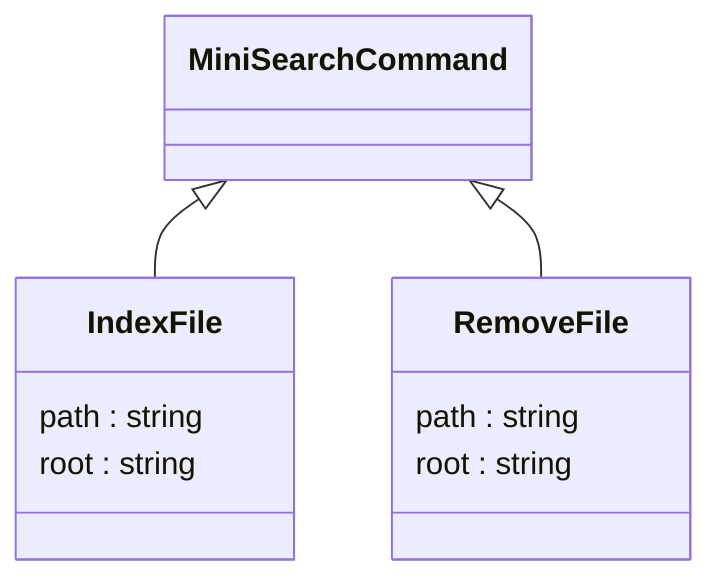

# MiniSearchCommands

- `IndexFile` requests the MiniSearch processor to index the file.
- `RemoveFile` requests the processor to remove the file from the index.



The `path` property in `IndexFile` and `RemoveFile` is the rooted path to the file within the repository, defined by the `root` property.

Example of the `IndexFile` command:

```json
{ "action": "index",
  "path": "/MiniSearchCommands.md",
  "root": "C:\\Users\\John\\Documents\\MyRepo" }
```

Example of the `RemoveFile` command:

```json
{ "action": "remove",
  "path": "/MiniSearchCommands.md",
  "root": "C:\\Users\\John\\Documents\\MyRepo" }
```
