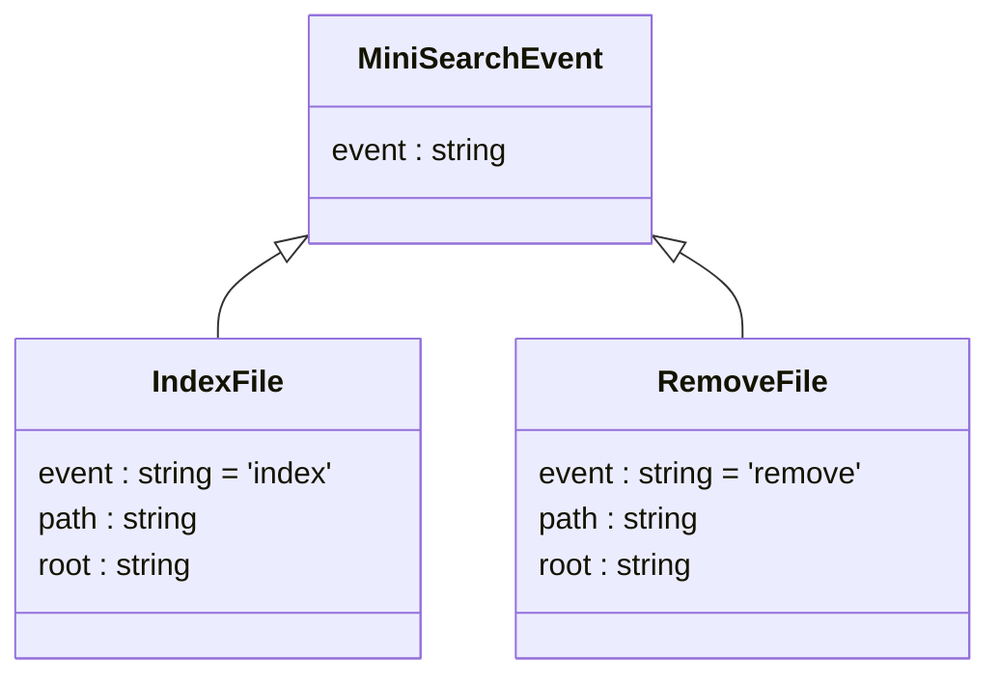

# MiniSearchEvents

- `IndexFile` requests the MiniSearch processor to index the file.
- `RemoveFile` requests the processor to remove the file from the index.



The `path` property in `IndexFile` and `RemoveFile` is the rooted path to
the file within the repository, defined by the `root` property.

Example of the `IndexFile` event:

```json
{ "event": "index",
  "path": "/MiniSearchEvents.md",
  "root": "C:\\Users\\John\\Documents\\MyRepo" }
```

Example of the `RemoveFile` event:

```json
{ "event": "remove",
  "path": "/MiniSearchEvents.md",
  "root": "C:\\Users\\John\\Documents\\MyRepo" }
```
